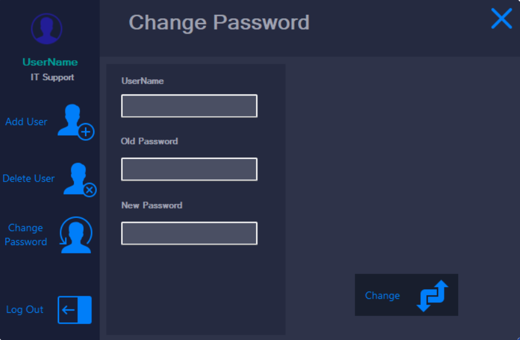

# InstaLib - Library Management System
Welcome to InstaLib, the ultimate solution for efficient and seamless library management. InstaLib helps you manage your library's inventory, track borrowing and returns, and streamline your library operations.

 <be>

 <be>

 <be>

 <be>

 <be>

 <be>

 <be>

  
